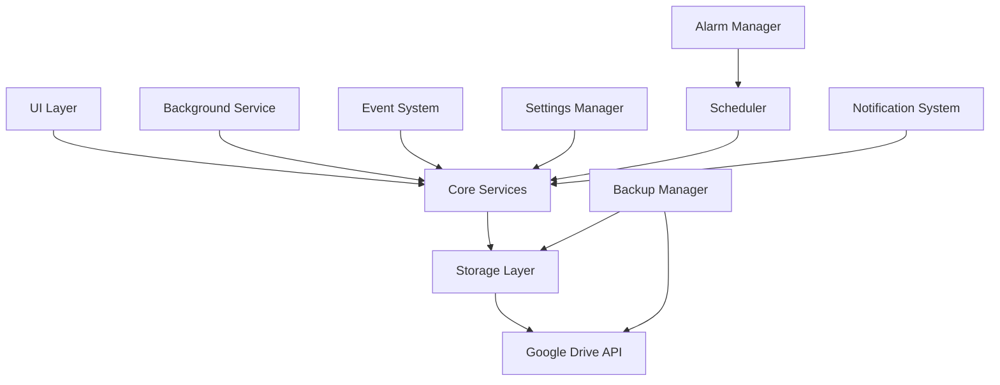

# Design Document: Release Preparation

## Overview

This design document outlines the approach for finalizing and polishing the BookDrive Chrome extension for its initial 1.0 release. The release preparation process encompasses code validation and completion, refactoring and cleanup, UI/UX enhancements, documentation updates, release management, CI/CD implementation, privacy compliance, and final quality assurance. The goal is to deliver a high-quality, production-ready extension that meets Chrome Web Store requirements and provides an excellent user experience.

## Architecture

The release preparation does not fundamentally change the architecture of the BookDrive extension but focuses on refining and completing the existing components. The current architecture consists of:

## Components and Interfaces

### 1. Code Validation and Completion

This component focuses on ensuring all code is validated, complete, and error-free.

#### Key Activities:
- **Syntax Error Detection and Correction**: Scan the codebase for syntax errors and fix them
- **ESLint/Prettier Compliance**: Ensure all code complies with ESLint and Prettier rules
- **Test Validation**: Fix failing tests and ensure comprehensive test coverage
- **Google Drive API Verification**: Validate all Google Drive API calls for correctness
- **Feature Completion**: Identify and complete partially implemented features

#### Validation Strategy:
- Use static code analysis tools to identify issues
- Run comprehensive test suites to detect runtime errors
- Manually review critical components like OAuth2 flows and API integrations
- Create a checklist of partially implemented features and complete them

### 2. Code Refactoring and Cleanup

This component focuses on improving code quality, maintainability, and organization.

#### Key Activities:
- **Code Refactoring**: Apply DRY principles and improve code clarity
- **Dead Code Removal**: Identify and remove unused files, functions, and variables
- **Configuration Consolidation**: Organize configuration settings into appropriate locations
- **Script Modernization**: Update or remove outdated scripts
- **Asset Cleanup**: Remove unreferenced assets

#### Refactoring Strategy:
- Use code complexity metrics to identify areas needing refactoring
- Apply consistent naming conventions and code structure
- Extract common functionality into reusable modules
- Implement proper error handling and logging
- Document complex algorithms and business logic

### 3. Material UI and UX Enhancements

This component focuses on ensuring a consistent, polished UI that follows Material Design principles.

#### Key Activities:
- **Design Token Standardization**: Apply consistent Material-UI design tokens
- **Component Styling**: Ensure cohesive spacing, typography, and button styles
- **Theme Implementation**: Support light, dark, and auto theme modes
- **Accessibility Improvements**: Ensure all components are accessible

#### UI Enhancement Strategy:
- Create a design token system for colors, spacing, typography, and elevation
- Implement consistent component styling across all UI elements
- Develop a theme switching mechanism that respects system preferences
- Conduct accessibility audits and implement necessary improvements

### 4. Documentation and Wiki Updates

This component focuses on providing clear, comprehensive documentation for users and developers.

#### Key Activities:
- **README Optimization**: Create a minimalistic README with essential information
- **Feature Status Table**: Develop a clear table showing implementation status
- **Wiki Documentation**: Create comprehensive wiki documentation
- **Setup Instructions**: Provide clear installation and configuration guides
- **Troubleshooting Guides**: Develop helpful troubleshooting resources

#### Documentation Strategy:
- Structure documentation for different audience needs (users vs. developers)
- Use consistent formatting and terminology
- Include visual aids like screenshots and diagrams
- Provide examples for common use cases
- Ensure documentation is easily navigable

### 5. Release Management

This component focuses on proper version management and release processes.

#### Key Activities:
- **Version Updates**: Update version to 1.0.0 in all relevant files
- **Branch Cleanup**: Ensure main branch is the single source of truth
- **Release Draft Creation**: Prepare a properly formatted GitHub release draft
- **Changelog Updates**: Create comprehensive release notes
- **Artifact Packaging**: Ensure proper extension packaging

#### Release Strategy:
- Implement semantic versioning (SemVer) for version management
- Create a standardized release template for GitHub releases
- Develop a changelog format that clearly communicates changes to users
- Establish a release checklist to ensure consistency

### 6. CI/CD Implementation

This component focuses on automating build and release processes.

#### Key Activities:
- **Build Workflow**: Create a workflow to build the extension artifact on push to main
- **Release Workflow**: Develop a workflow to publish the extension when triggered
- **User Accessibility**: Ensure workflows can be run by any user without local setup
- **CI/CD Verification**: Implement necessary checks in the CI/CD pipeline

#### CI/CD Strategy:
- Use GitHub Actions for workflow automation
- Implement caching to improve build performance
- Create separate workflows for different stages (build, test, release)
- Add appropriate security checks and validations

### 7. Privacy and Compliance

This component focuses on ensuring the extension respects user privacy and complies with Chrome Web Store requirements.

#### Key Activities:
- **Privacy Policy Creation**: Develop a comprehensive privacy policy
- **Permission Verification**: Ensure permissions align with the privacy policy
- **Manifest Compliance**: Confirm the manifest meets Chrome Web Store requirements
- **Data Collection Audit**: Verify no unnecessary data collection occurs

#### Compliance Strategy:
- Review Chrome Web Store policies and requirements
- Audit all data collection and storage mechanisms
- Implement privacy-by-design principles
- Create clear user consent mechanisms where needed

### 8. Final Quality Assurance

This component focuses on thorough testing to ensure a reliable extension.

#### Key Activities:
- **Installation Testing**: Verify the extension works correctly as an unpacked extension
- **Sync Cycle Testing**: Ensure sync cycles complete successfully
- **Offline/Online Testing**: Test recovery in offline/online scenarios
- **Final Code Review**: Conduct a comprehensive code review

#### QA Strategy:
- Develop a test plan covering all critical functionality
- Implement automated tests where possible
- Conduct manual testing for user experience aspects
- Create a regression test suite for future releases

## Data Models

No new data models are introduced as part of the release preparation. The focus is on refining and completing existing models.

## Error Handling

### Error Handling Strategy:
- Implement consistent error handling across the codebase
- Provide user-friendly error messages
- Log detailed error information for debugging
- Implement graceful degradation for non-critical failures
- Add recovery mechanisms for common error scenarios

## Security Considerations

1. **Permission Management**:
   - Review and minimize required permissions
   - Clearly document permission usage
   - Implement principle of least privilege

2. **Data Protection**:
   - Audit data storage practices
   - Implement secure deletion where appropriate
   - Verify encryption implementation (if applicable)

3. **Code Security**:
   - Follow Manifest V3 security best practices
   - Remove any unsafe coding practices
   - Implement Content Security Policy
   - Conduct security review

## Testing Strategy

### Testing Approach:
- **Unit Tests**: Verify individual components function correctly
- **Integration Tests**: Ensure components work together properly
- **End-to-End Tests**: Validate complete user workflows
- **Manual Testing**: Verify user experience and edge cases
- **Cross-Browser Testing**: Ensure compatibility across supported browsers

### Test Coverage:
- Core functionality (bookmark sync, backup/restore)
- Error handling and recovery
- UI components and interactions
- Performance under various conditions
- Security and privacy features

## Implementation Plan

The implementation will follow a systematic approach:

1. **Assessment Phase**:
   - Code review and issue identification
   - Feature completion inventory
   - Documentation gap analysis

2. **Refinement Phase**:
   - Code cleanup and refactoring
   - UI/UX enhancements
   - Documentation updates

3. **Finalization Phase**:
   - Version updates
   - Release preparation
   - CI/CD implementation

4. **Verification Phase**:
   - Comprehensive testing
   - Final review
   - Release candidate preparation

## UI/UX Design

### Design Principles:
- Clean, minimal interface with focus on usability
- Consistent visual language across all screens
- Clear feedback for all user actions
- Accessible to all users regardless of abilities
- Responsive design that works across device sizes

### Key UI Improvements:
1. **Consistent Styling**:
   - Standardize colors, typography, and spacing
   - Apply Material Design principles consistently
   - Ensure visual hierarchy guides user attention

2. **Theme Support**:
   - Implement proper light and dark themes
   - Ensure all components respect theme settings
   - Add automatic theme switching based on system preferences

3. **Accessibility Enhancements**:
   - Improve keyboard navigation
   - Add proper ARIA attributes
   - Ensure sufficient color contrast
   - Support screen readers

4. **Visual Feedback**:
   - Add loading indicators for asynchronous operations
   - Implement toast notifications for important events
   - Provide clear error messages and recovery options

## Documentation Structure

### README.md:
- Project name and brief description
- 3-5 bullet highlights of key features
- Feature status table
- Link to full documentation
- Essential setup/build/test commands

### Wiki Documentation:
- Installation guide
- OAuth setup instructions
- Feature documentation
- Troubleshooting guide
- Privacy policy
- Architecture overview
- API reference
- Changelog

## Release Management Process

### Version Update Process:
1. Update version in package.json
2. Update version in manifest.json
3. Update version in any other relevant files
4. Update CHANGELOG.md with release notes

### GitHub Release Format:
- Title: "v1.0.0 – Initial Public Release"
- What's New: Bullet list of new features and improvements
- Upgrade Notes: Information for users upgrading from previous versions
- Links: Privacy policy and Web Store listing guidelines

### CI/CD Workflow:
1. Build workflow triggers on push to main
2. Tests run automatically
3. Extension artifact is generated
4. Release workflow can be manually triggered
5. Release is tagged and published when approved